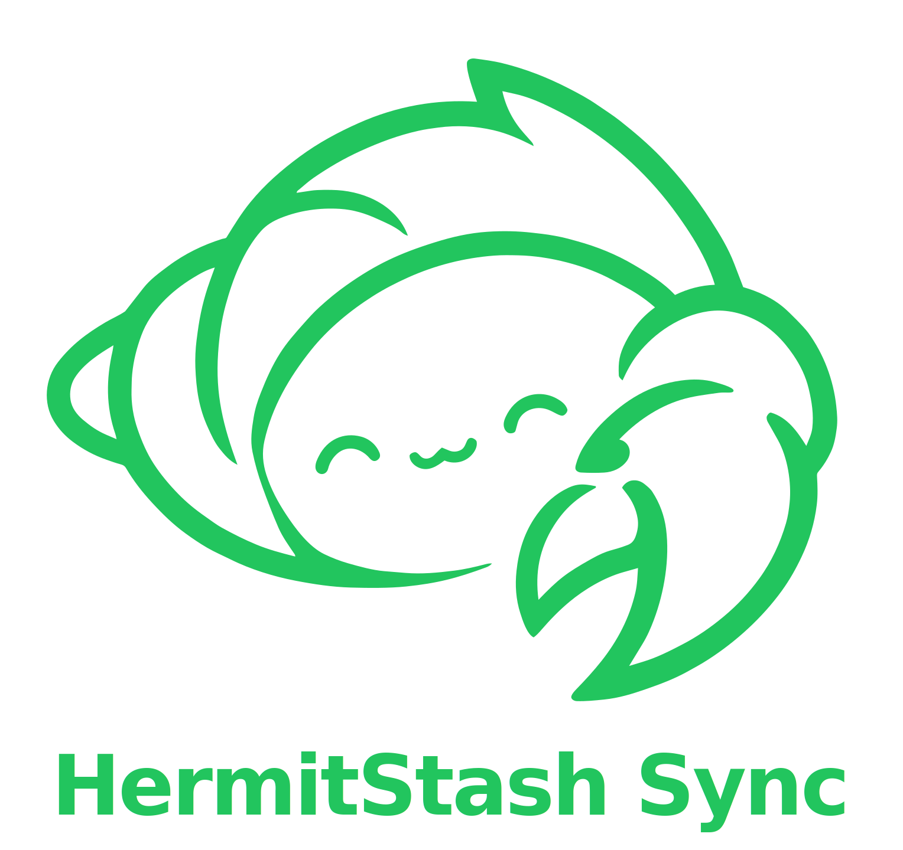

<p align="center">
  
</p>

# HermitStash Sync

Desktop file sync client for [HermitStash](https://github.com/dotCooCoo/hermitstash) — post-quantum encrypted, self-hosted file sync.

---

### A quick note

HermitStash Sync is the companion to [HermitStash](https://github.com/dotCooCoo/hermitstash) — same author, same philosophy, same caveats. If you haven't read the note at the top of the main repo, the short version is: this is a personal project, built by someone who is not a cryptographer, and it hasn't been audited.

This client inherits its security posture from HermitStash and from Node.js's OpenSSL 3.5 — I'm not rolling my own TLS or inventing key exchanges. But a sync client introduces its own surface area (file watching, state tracking, daemon lifecycle), and those parts are entirely my own work. I've tried to be careful, but "tried to be careful" is not a substitute for a professional review.

If you're already running HermitStash and you want your files to show up on the other end without dragging them there yourself — this is for that. If you're evaluating it for something where reliability and security truly matter, please factor in that it's one person, spare time, and zero formal review.

— .CooCoo ([@dotCooCoo](https://github.com/dotCooCoo))

> **Status:** Personal project · Not audited · API may change · Use at your own risk

---

## What it does

Watches a local folder and keeps it in sync with a HermitStash server:

- **New files** are uploaded automatically
- **Modified files** are re-uploaded (server detects and replaces)
- **Deleted files** are removed from the server
- **Server-side changes** are downloaded in real-time via WebSocket
- **Conflict resolution** is last-write-wins — if both sides change a file, the most recent write takes priority

All connections use PQC TLS (X25519MLKEM768 hybrid key exchange, TLS 1.3 minimum) with optional mTLS client certificates.

## Requirements

- Node.js 24+ (for `node:sqlite` and OpenSSL 3.5+ PQC support)
- HermitStash server v1.3.4+ with sync features enabled

## Install

```bash
# From source
git clone https://github.com/dotCooCoo/hermitstash-sync.git
cd hermitstash-sync

# Or use pre-built binary (no Node.js required)
# Download from Releases for your platform
```

## Quick Start

```bash
# 1. Set up the connection
hermitstash-sync init

# 2. Start syncing (foreground)
hermitstash-sync start

# 3. Or run as a background daemon
hermitstash-sync start --daemon

# 4. Check status
hermitstash-sync status

# 5. Stop the daemon
hermitstash-sync stop
```

## Commands

| Command | Description |
|---------|-------------|
| `init` | Interactive setup — server URL, API key, sync folder |
| `start` | Start sync in foreground |
| `start --daemon` | Start sync as background daemon |
| `status` | Show sync status (running/stopped, file count, errors) |
| `stop` | Stop the background daemon |
| `log` | Show last 50 log lines |
| `log --follow`, `-f` | Tail the log file in real-time |
| `resync` | Force a full re-sync from scratch |
| `version` | Show version and OpenSSL info |
| `--help`, `-h` | Show usage information |

## Configuration

Config file: `~/.hermitstash-sync/config.json`

```json
{
  "server": "https://hermitstash.com",
  "bundleId": "your-sync-bundle-id",
  "shareId": "your-share-id",
  "syncFolder": "/home/user/Documents/synced",
  "mtls": {
    "cert": "/path/to/client.crt",
    "key": "/path/to/client.key",
    "ca": "/path/to/ca.crt"
  },
  "ignore": ["*.log", "build/**"],
  "logLevel": "info"
}
```

### Ignore Patterns

The following patterns are always excluded from sync:

| Pattern | Reason |
|---------|--------|
| `.DS_Store`, `.Spotlight-V100/**`, `.Trashes/**` | macOS system files |
| `Thumbs.db`, `ehthumbs.db`, `desktop.ini` | Windows system files |
| `.git/**`, `.svn/**` | Version control |
| `node_modules/**`, `__pycache__/**` | Package/build artifacts |
| `*.tmp`, `*.swp`, `*.swo`, `*~` | Editor temp files |
| `.hermitstash-sync/**` | Client config directory |

Add custom patterns in:
- `config.json` → `ignore` array
- `.hermitstash-ignore` file in the sync folder root (one pattern per line, `#` comments supported)

Supported pattern syntax: exact filename (`file.txt`), extension (`*.log`), and directory recursion (`build/**`).

### API Key Storage

The API key is stored in your OS keychain:
- **macOS:** Keychain Access
- **Linux:** GNOME Keyring / KDE Wallet (via `secret-tool`)
- **Windows:** Windows Credential Manager

Falls back to `~/.hermitstash-sync/credentials` (permissions `0600`) on headless systems.

## Security

- **PQC TLS** on every connection — both `ecdhCurve` and `groups` set for X25519MLKEM768 compatibility
- **mTLS** client certificates for server authentication (optional, certs cached in memory)
- **SHA3-512** checksums verified before file rename — mismatched downloads never appear in sync folder
- **Path traversal protection** — all server-provided paths validated against sync folder boundary
- **Symlink protection** — symlinks skipped during directory walk and file watching (prevents escape)
- **API key** in OS keychain, never in plaintext config or log files
- **Atomic writes** — downloads write to `.tmp` file, verify checksum, then rename
- **Stale temp cleanup** — orphaned `.tmp` files from interrupted downloads removed on startup
- **Download suppression** — files written by the sync engine don't trigger re-upload
- **PID file locking** — exclusive create prevents two daemon instances from racing
- **State DB integrity** — SQLite integrity check on startup with auto-recovery on corruption
- **HTTP timeouts** — all requests time out after 30 seconds to prevent hangs
- **Log rotation** — log file rotated at 10MB to prevent disk exhaustion
- **Log symlink protection** — log path checked for symlinks before opening
- **Disk space guard** — downloads pause if free space drops below 100 MB
- **TLS 1.3 minimum** — connections below TLS 1.3 are rejected
- **Filename sanitization** — multipart upload headers strip injection characters
- **Response body limiting** — error responses capped at 64 KB to prevent memory exhaustion
- **Zero npm dependencies** — entire codebase is auditable

## How sync works

1. On first connection with a `shareId` configured, the client fetches the bundle manifest and downloads all existing files from the server, then uploads any local files not yet on the server.
2. After initial sync, the client enters a real-time loop: a WebSocket receives change events (`file_added`, `file_replaced`, `file_removed`) and a file watcher detects local changes. Changes are debounced (500 ms) to avoid redundant uploads during active writes.
3. If the connection drops, the client reconnects with exponential backoff (1s → 2s → 4s → ... → 5 min max). On reconnect, it sends the last known sequence number so the server can replay missed events.
4. The server sends a heartbeat every 30 seconds. If no message arrives within 90 seconds, the client treats the connection as dead and reconnects.
5. Failed uploads are retried up to 3 times with a 5-second delay between attempts.

### Sync states

The `status` command shows which state the daemon is in:

| State | Meaning |
|-------|---------|
| `DISCONNECTED` | Not connected to server |
| `CONNECTING` | Establishing WebSocket connection |
| `CATCHING_UP` | Downloading changes missed while offline |
| `SYNCED` | Fully synchronized, watching for changes |
| `UPLOADING` | Actively uploading files |
| `DOWNLOADING` | Actively downloading files |
| `RECONNECTING` | Connection lost, waiting to retry |
| `ERROR` | Something went wrong (check logs) |

## Logging

Logs are written to `~/.hermitstash-sync/hermitstash-sync.log` in JSON format (one object per line with `ts`, `level`, `msg` fields). Log levels: `debug`, `info`, `warn`, `error`.

The log file is rotated at 10 MB — the current log is renamed to `.log.1` and a fresh file is started. Only one rotated copy is kept.

## Platform notes

| | macOS | Linux | Windows |
|---|---|---|---|
| Keychain | Keychain Access | GNOME Keyring / KDE Wallet | Credential Manager |
| Daemon | `start --daemon` | `start --daemon` | `start --daemon` |
| Resync signal | `SIGHUP` | `SIGHUP` | Not supported — restart the daemon |
| Auto-start | launchd | systemd | Task Scheduler |

## Auto-start (Optional)

### Linux (systemd)

```ini
# ~/.config/systemd/user/hermitstash-sync.service
[Unit]
Description=HermitStash Sync
After=network-online.target

[Service]
ExecStart=/usr/local/bin/hermitstash-sync start
Restart=on-failure
RestartSec=10

[Install]
WantedBy=default.target
```

```bash
systemctl --user enable hermitstash-sync
systemctl --user start hermitstash-sync
```

### macOS (launchd)

```xml
<!-- ~/Library/LaunchAgents/com.hermitstash.sync.plist -->
<?xml version="1.0" encoding="UTF-8"?>
<!DOCTYPE plist PUBLIC "-//Apple//DTD PLIST 1.0//EN" "http://www.apple.com/DTDs/PropertyList-1.0.dtd">
<plist version="1.0">
<dict>
  <key>Label</key><string>com.hermitstash.sync</string>
  <key>ProgramArguments</key>
  <array>
    <string>/usr/local/bin/hermitstash-sync</string>
    <string>start</string>
  </array>
  <key>RunAtLoad</key><true/>
  <key>KeepAlive</key><true/>
</dict>
</plist>
```

## Building SEA Binary

```bash
# Requires Node.js 22+ and postject
node --experimental-sea-config build/sea-config.json
cp $(which node) build/hermitstash-sync
npx postject build/hermitstash-sync NODE_SEA_BLOB build/hermitstash-sync.blob \
  --sentinel-fuse NODE_SEA_FUSE_fce680ab2cc467b6e072b8b5df1996b2
```

## Contributing

I want to be straightforward about this: I'm not currently accepting code contributions, and I want to explain why rather than just saying no.

HermitStash Sync is a security-focused project maintained by one person. Reviewing external code contributions to a cryptographic system is something I don't feel I can do responsibly right now — I'm still learning, and I'd rather not merge code I can't fully evaluate myself. Accepting PRs would mean either rubber-stamping changes I don't understand (bad) or asking contributors to wait indefinitely while I figure it out (also bad). The honest answer is that I'm not set up for it yet.

That said, there are a lot of ways to help that I genuinely welcome:

- **Bug reports.** If something doesn't work, or works in a way that surprises you, please open an issue. Steps to reproduce help a lot.
- **Security findings.** If you spot a cryptographic issue, a misuse of a primitive, or anything that contradicts a security claim in the README, please report it privately — see SECURITY.md for how.
- **Feature requests.** Open an issue describing the use case. I can't promise I'll build it, but I want to hear what people would find useful.
- **Documentation feedback.** If something in the README is unclear, wrong, or missing, an issue is great. Documentation issues are some of the most useful kinds of feedback I get.
- **Questions.** If you're trying to use HermitStash Sync and something isn't clear, asking is welcome.

If you've built something on top of HermitStash, or you're running it somewhere interesting, I'd love to hear about that too — feel free to open an issue just to say hi.

This may change in the future. If HermitStash Sync grows to a point where I can responsibly review external code, I'll update this section. Until then: thank you for understanding, and thank you for being interested enough to consider contributing in the first place.

## License

MIT

## A final note

If you've read this far — thank you. Building and sharing HermitStash has been one of the most rewarding things I've worked on, and the fact that you took the time to look at it means a lot.

If HermitStash has been useful to you and you'd like to buy me a coffee, you can do so at [ko-fi.com/dotcoocoo](https://ko-fi.com/dotcoocoo). It's never expected, always appreciated.
