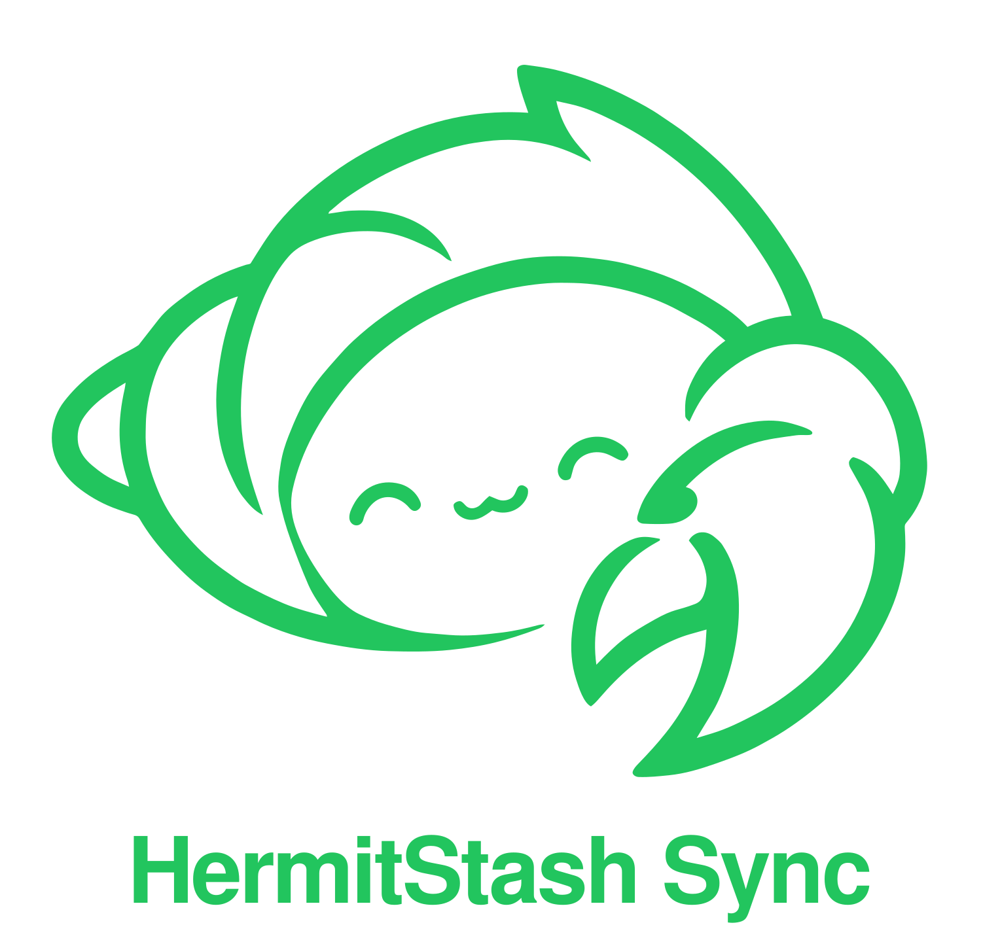

<p align="center">
  
</p>

<h1 align="center">HermitStash Sync</h1>

<p align="center">
  Desktop file sync client for <a href="https://github.com/dotCooCoo/hermitstash">HermitStash</a> — post-quantum encrypted, self-hosted file sync.
</p>

<p align="center">
  <a href="LICENSE">AGPL-3.0</a> · <a href="SECURITY.md">Security Policy</a> · <a href="https://ko-fi.com/dotcoocoo">Support on Ko-fi</a>
</p>

---

### A quick note

HermitStash Sync is the companion to [HermitStash](https://github.com/dotCooCoo/hermitstash) — same author, same philosophy, same caveats. If you haven't read the note at the top of the main repo, the short version is: this is a personal project, built by someone who is not a cryptographer, and it hasn't been audited.

This client inherits its security posture from HermitStash and from Node.js's OpenSSL 3.5 — I'm not rolling my own TLS or inventing key exchanges. But a sync client introduces its own surface area (file watching, state tracking, daemon lifecycle), and those parts are entirely my own work. I've tried to be careful, but "tried to be careful" is not a substitute for a professional review.

If you're already running HermitStash and you want your files to show up on the other end without dragging them there yourself — this is for that. If you're evaluating it for something where reliability and security truly matter, please factor in that it's one person, spare time, and zero formal review.

— .CooCoo ([@dotCooCoo](https://github.com/dotCooCoo))

> **Status:** Personal project · Not audited · API may change · Use at your own risk

---

## Built on [blamejs](https://github.com/blamejs/blamejs)

<p align="center">
  <a href="https://github.com/blamejs/blamejs">
    
  </a>
</p>

<p align="center">
  <strong><em>The Node framework that owns its stack.</em></strong>
</p>

HermitStash Sync vendors [**blamejs**](https://github.com/blamejs/blamejs) — a single, audit-able framework that bundles its own crypto, transports, validation, and process-lifecycle primitives instead of pulling them from forty transitive npm packages. That's how this client ships with **zero npm runtime dependencies** while still getting:

- **PQC TLS 1.3 agent** (`b.pqcAgent`) — `SecP384r1MLKEM1024:X25519MLKEM768:SecP256r1MLKEM768:X25519` posture (post-quantum hybrids preferred, `X25519` classical last-resort) pinned for both the mTLS sync transport and the auto-update GitHub-release downloader. On HermitStash-server connections the client verifies post-handshake that the *negotiated* group is a post-quantum hybrid and refuses a classical fallback (the auto-update downloader, which talks to a non-PQC CDN, warns instead of failing)
- **Hardened HTTP client** (`b.httpClient.request`) — SSRF gate with DNS pinning that closes the resolve-vs-connect TOCTOU window, AbortSignal, idle-vs-wall-clock timeout split, permanent-vs-transient classifier, h2 via ALPN
- **Hardened WebSocket client** (`b.wsClient`) — RFC 6455 with decompression-bomb defence, UTF-8 fatal validation, ≤125-byte control-frame cap, RSV1-on-continuation rejection, permanent-error classifier
- **Per-session encryption envelope** (`b.middleware.apiEncrypt` / `b.httpClient.encrypted`) — ML-KEM-1024 + ECDH P-384 + SHAKE256 + XChaCha20-Poly1305, identity-agile 4-byte version header
- **Daemon lifecycle** (`b.daemon`, `b.appShutdown.pidLock`) — atomic-create pidfile, SIGTERM→SIGKILL escalation, phase-ordered graceful shutdown
- **Cross-platform file watcher** (`b.watcher`) — fs.watch + event coalescing + symlink-skip + debounce on real kernels, polling fallback for bind mounts and FUSE filesystems
- **Self-update lifecycle** (`b.selfUpdate.{poll,verify,swap,rollback}`) — semver-aware GitHub Releases poll, ECDSA P-384 detached-signature verify, atomic backup-and-rename swap with rollback
- **Validation primitives** (`b.safeJson`, `b.safeUrl`, `b.atomicFile`, `b.retry`, `b.safeAsync.repeating`) — depth/size/prototype caps, atomic-rename + fsync, full-jitter exponential backoff, error-swallowing recurring timers
- **Vendored ML-KEM-1024 + XChaCha20-Poly1305** via blamejs's own pinned `noble-post-quantum` / `noble-ciphers` cjs bundles

The client sits as a thin specialization on top — sync engine, file watcher integration, state DB, and CLI surface — while the wire layer, crypto layer, and process layer are blamejs's responsibility. Every refresh of `vendor/blamejs/` carries upstream security backports across all of those primitives at once.

If you're building something else and find yourself reaching for this same set of primitives, give blamejs a look: <https://github.com/blamejs/blamejs>.

---

## What it does

Watches a local folder and keeps it in sync with a HermitStash server:

- **New files** are uploaded automatically
- **Modified files** are re-uploaded (server detects and replaces)
- **Renamed/moved files** are detected by checksum matching — server updates the path without re-uploading the file
- **Deleted files** are removed from the server
- **Server-side changes** are downloaded in real-time via WebSocket
- **Conflict resolution** is last-write-wins — if both sides change a file, the most recent write takes priority

All connections use PQC TLS with TLS 1.3 minimum and a hybrid group list (`SecP384r1MLKEM1024` → `X25519MLKEM768` → `SecP256r1MLKEM768`, Level 5 preferred) with an `X25519` classical last-resort that matches the server's group preference, plus optional mTLS client certificates. The post-quantum hybrids stay preferred, and after each HermitStash-server handshake the client verifies the *negotiated* group is a post-quantum hybrid — a classical fallback is logged and the connection is refused (set `HERMITSTASH_ALLOW_CLASSICAL_TLS=1` to permit it deliberately). Client certs auto-renew on startup when within 60 days of expiry — no admin action needed.

## Requirements

- Node.js 24.16.0+ (vendored blamejs's effective floor; also covers `node:sqlite` and OpenSSL 3.5+ PQC support)
- HermitStash server v1.9.19+ with sync features enabled. v1.9.19 ships blamejs v0.8.43+ which emits 0xE2-magic envelopes; this client (on blamejs v0.15.14) requires that posture. Servers below v1.9.19 still on the 0xE1 envelope are not compatible.
- The encrypted control-plane routes — file rename and public-uploader bundle init/finalize — additionally require a server built on a matching v0.15.x blamejs. Its per-session api-encrypt envelope binds the request fields into the AEAD, and a server on an older framework rejects the request. Upload, download, metadata, delete, and the WebSocket sync stream are unaffected by this requirement.

## Install

```bash
# From source
git clone https://github.com/dotCooCoo/hermitstash-sync.git
cd hermitstash-sync

# Or use pre-built binary (no Node.js required)
# Download from Releases for your platform

# Or run in Docker (see below)
docker pull ghcr.io/dotcoocoo/hermitstash-sync:latest
```

## Docker

The image pulls the signed SEA binary from the matching GitHub Release during build, verifies its SHA3-512 checksum and P-384 ECDSA signature before installing, and runs non-root with a minimal Debian-slim base. Two volumes: `/config` holds persistent state (API key, mTLS certs, state DB, logs), `/data` is the sync folder.

```bash
# First run — enrolls and starts syncing
docker run -d \
  --name hermitstash-sync \
  -e HERMITSTASH_SERVER_URL=https://hermitstash.example.com \
  -e HERMITSTASH_ENROLLMENT_CODE=HSTASH-XXXX-XXXX-XXXX \
  -v hermitstash-sync-config:/config \
  -v /path/on/host:/data \
  --restart unless-stopped \
  ghcr.io/dotcoocoo/hermitstash-sync:latest
```

Subsequent restarts skip enrollment — the API key and mTLS certs persist on the `hermitstash-sync-config` volume. A Compose file is available at `docker-compose.example.yml`.

Auto-update is always disabled inside the container (binary self-replace would violate the immutable-image model — pull a new image tag to upgrade). All other features (mTLS cert auto-renewal, PQC TLS, SHA3-512 checksums, sync bundle semantics) work identically to the native binary.

**Testing:** PRs touching `Dockerfile`, `docker/`, or `scripts/verify-release.js` trigger `.github/workflows/docker-e2e.yml`, which builds the image against the latest published release and runs packaging checks (OCI labels, non-root user, volumes, env defaults, entrypoint error paths). Full container-to-server e2e (enrollment, bidirectional sync, restart persistence, graceful shutdown) runs locally via `node tests/run-all.js` when Docker is available on the dev machine.

## Other deployment platforms

In addition to the Docker image, the repo ships reference configs for running the daemon natively or on common orchestration platforms. Each is self-contained and shows the sync-client-specific shape: outbound-only, two volumes (`/config` + `/data`), enrollment via env vars on first run.

| Platform | File | Notes |
| --- | --- | --- |
| **Unraid** | `unraid-template.xml` | Community Apps template. Point the template URL at `https://raw.githubusercontent.com/dotCooCoo/hermitstash-sync/main/unraid-template.xml` to install. |
| **systemd (native Linux)** | `deploy/install.sh` + `deploy/hermitstash-sync.service` | `curl | sudo bash` one-liner: downloads the signed SEA binary, verifies SHA3-512 + P-384 ECDSA, installs under `/usr/local/bin/hermitstash-sync`, creates a `hermit` system user, and lays down a hardened systemd unit. Pair with `deploy/update.sh` + timer for unattended updates. Uninstall via `deploy/uninstall.sh`. |
| **Podman** | `deploy/podman.sh` | Rootless by default (RHEL/Fedora/Alma/Rocky idiomatic). Also generates a user or system systemd unit for auto-restart. Image carries the `io.containers.autoupdate=registry` label so `podman-auto-update.timer` can refresh it. |
| **Kubernetes** | `deploy/kubernetes.yml` | Namespace + 2 PVCs + Deployment (replicas=1, strategy=Recreate) + Secret for enrollment. No Service — the client is outbound-only. `runAsNonRoot`, `readOnlyRootFilesystem`, dropped capabilities. |

For fleet deployment, use `deploy/install.sh` inside Ansible / SaltStack / your config-management tool of choice — it's idempotent and respects the standard `VERSION`, `INSTALL_DIR`, `CONFIG_DIR`, `SYNC_DIR`, `SERVICE_USER` env overrides.

### Update mechanisms

Each deployment shape has its own update path. The in-binary self-replace only runs when the daemon has write access to its own executable — otherwise an external updater handles it.

| Deployment | Update path | Enabled by default |
| --- | --- | --- |
| **Bare binary** (no systemd) | In-daemon: polls GitHub every 6h, verifies SHA3-512 + ECDSA, renames current → `.prev`, spawns new, 60s probation + auto-rollback on crash. | Yes — config `"autoUpdate": true` |
| **systemd** (via `install.sh`) | External: `hermitstash-sync-update.timer` fires daily + 4h random delay; `update.sh` downloads + verifies + atomic swap + `systemctl restart`, rolls back if the daemon doesn't report RUNNING within 60s. In-daemon path is disabled (can't cross the root/hermit permission boundary under `ProtectSystem=strict`). | Opt-in — install with `HERMITSTASH_AUTO_UPDATE=yes` to enable the timer |
| **Docker** | Pull a new image tag manually (`docker pull ... && docker restart ...`). In-daemon self-replace is hard-disabled — mutating `/usr/local/bin` inside a running image violates the immutable-image model. | No |
| **Podman** | `podman auto-update` reads the image's `io.containers.autoupdate=registry` label and pulls the newest digest for the current tag. Enable `podman-auto-update.timer` (system or `--user`) to run on a schedule. | Opt-in via timer |
| **Kubernetes** | Bump the image tag in your manifest and `kubectl apply`. `imagePullPolicy: IfNotPresent` means you need to delete the pod or roll the Deployment to pick up a floating tag. Consider a pinned digest + a GitOps flow for production. | No |

## Quick start

```bash
# 1. Set up the connection
hermitstash-sync init

# 2. Start syncing (foreground)
hermitstash-sync start

# 3. Or run as a background daemon
hermitstash-sync start --daemon

# 4. Check status
hermitstash-sync status

# 5. Stop the daemon
hermitstash-sync stop
```

## Commands

| Command | Description |
| --- | --- |
| `init` | Interactive setup — enrollment code or API key, server URL, sync folder |
| `init --non-interactive` | Headless enrollment from env vars (`HERMITSTASH_SERVER_URL`, `HERMITSTASH_ENROLLMENT_CODE`, `HERMITSTASH_SYNC_FOLDER`, `HERMITSTASH_AUTO_UPDATE`) — intended for Docker/CI |
| `start` | Start sync in foreground |
| `start --daemon` | Start sync as background daemon |
| `start --no-autoupdate` | Start without polling GitHub Releases for new binaries |
| `status` | Show sync status, file count, last sync time, errors |
| `stats` | Print daemon telemetry — uploads/downloads/retries, WS reconnects, upload circuit-breaker state. Reads `$CONFIG_DIR/stats.json` (refreshed every 15s by the daemon). `--json` for machine-readable output, `--prometheus` for textfile-collector exposition. |
| `stop` | Stop the background daemon |
| `log` | Show last 50 log lines |
| `log --follow`, `-f` | Tail the log file in real-time |
| `resync` | Force a full re-sync from scratch |
| `repair` | Re-provision mTLS certificate using an admin-issued enrollment code (run this if your cert is revoked or the daemon can't connect after a certificate reissue) |
| `diagnose` | Bundle non-secret operational state (redacted config, state DB schema, cert subject, rotated logs, stats snapshot, version banner) into a single `.zip` for support handoff. Excludes credentials, the mTLS private key, sync-folder contents, and DB rows. `--out <path>` overrides the default `./hermitstash-sync-diagnose-<ISO>.zip`. |
| `version` | Show version and OpenSSL info |
| `--help`, `-h` | Show usage information |

## Configuration

Config file: `~/.hermitstash-sync/config.json` (or `$HERMITSTASH_SYNC_CONFIG_DIR/config.json` — useful for containers, where `/config` is a common mount point).

```json
{
  "server": "https://hermitstash.com",
  "bundleId": "your-sync-bundle-id",
  "shareId": "your-share-id",
  "syncFolder": "/home/user/Documents/synced",
  "mtls": {
    "cert": "/path/to/client.crt",
    "key": "/path/to/client.key",
    "ca": "/path/to/ca.crt"
  },
  "ignore": ["*.log", "build/**"],
  "include": [],
  "pinnedServerSpki": [],
  "logLevel": "info",
  "autoUpdate": true,
  "autoUpdateChannel": "stable",
  "uploadConcurrency": 4,
  "uploadBytesPerSec": 0,
  "downloadBytesPerSec": 0
}
```

Every numeric / enum / array field is also exposed as an env var so container deployments can tune without editing `config.json` in a mounted volume:

| Env var | Maps to | Notes |
| --- | --- | --- |
| `HERMITSTASH_UPLOAD_CONCURRENCY` | `uploadConcurrency` | Integer 1..16 |
| `HERMITSTASH_UPLOAD_BYTES_PER_SEC` | `uploadBytesPerSec` | 0 = unlimited |
| `HERMITSTASH_DOWNLOAD_BYTES_PER_SEC` | `downloadBytesPerSec` | 0 = unlimited |
| `HERMITSTASH_AUTO_UPDATE` | `autoUpdate` | `true`/`false` (or `0`/`1`/`yes`/`no`/`on`/`off`) |
| `HERMITSTASH_AUTO_UPDATE_CHANNEL` | `autoUpdateChannel` | `stable` or `beta` |
| `HERMITSTASH_LOG_LEVEL` | `logLevel` | `debug`/`info`/`warn`/`error` |
| `HERMITSTASH_PINNED_SERVER_SPKI` | `pinnedServerSpki` | Comma-separated `sha256/<base64>` pins |
| `HERMITSTASH_INCLUDE` | `include` | Comma-separated patterns |
| `HERMITSTASH_IGNORE` | `ignore` | Comma-separated patterns |

Env vars overlay `config.json` (env wins). All values are validated at config-load — typos in the env (`HERMITSTASH_AUTO_UPDATE_CHANNEL=nightly`, malformed SPKI pin, non-integer concurrency) refuse to boot with a clear error, rather than silently falling back to defaults or crashing the matcher on first file change.

### Selective sync (subdir allowlist)

By default the daemon syncs every file in `syncFolder` not caught by an ignore pattern. To restrict sync to specific subtrees, set `"include": [...]` in `config.json` or drop a `.hermitstash-include` file in the sync folder. Pattern grammar matches the ignore matcher: exact path, basename (no `/`), `*.ext`, or `dir/**` for recursive subtree inclusion.

```json
{
  "include": ["work/**", "photos/2026/**", "notes.md"]
}
```

With selective sync on, the daemon never uploads out-of-scope local files and never downloads out-of-scope server files. Server events for out-of-scope paths are seq-acknowledged but otherwise ignored — the daemon stays in sync without ever materializing the excluded files locally. A rename that crosses the scope boundary is handled as a delete (out-of-scope side) or add (in-scope side) at file granularity. Empty `include` array = everything (default behavior).

### SPKI cert pinning (opt-in)

For deployments that need to bind the daemon to a specific server identity (defence against compromised public CAs, MITM via stolen-CA cert chains), set `pinnedServerSpki` to one or more SubjectPublicKeyInfo SHA-256 hashes in the `sha256/<base64>` shape:

```json
{
  "pinnedServerSpki": [
    "sha256/Lp4r8Y2nW/zk0+m9F1xLqHfQ4yC9XQz5RbY8WzVdH+s=",
    "sha256/r1tEqyHFq4N6yL7/W/V1xWqHfQ4yC9XQz5RbY8WzVdH=="
  ]
}
```

Every TLS handshake (HTTPS + WebSocket) must produce a leaf cert whose SPKI hash matches one of the listed pins. Layered ON TOP of the default chain + hostname checks — pinning is additive, not a bypass.

The pin binds to the public-key bytes, not the cert. Cert rotation that reuses the same keypair keeps the pin valid (the deliberate key-continuity property). Planned key rotations are supported by listing both old + new pins during the cutover window.

To compute your server's pin: run `hermitstash-sync diagnose` and read the `spkiPin` field from `cert-info.json` inside the bundle. Or with openssl:

```bash
openssl x509 -in server.crt -pubkey -noout \
  | openssl pkey -pubin -outform der \
  | openssl dgst -sha256 -binary \
  | base64
# prefix with "sha256/" and add to config.pinnedServerSpki
```

Empty array (default) = no pinning, the default trust chain wins. Get the pin wrong and the daemon refuses every connection — keep at least one current + one backup pin during rotations.

### Bandwidth limit

Cap the bytes-per-second the daemon will push or pull across all concurrent transfers via `"uploadBytesPerSec"` / `"downloadBytesPerSec"` in `config.json`. Both default to `0` (unlimited). The limit is a shared token bucket per direction, so N parallel uploads share the same budget instead of each getting the full rate. Useful for users on shared connections or metered links.

```json
{
  "uploadBytesPerSec":   524288,
  "downloadBytesPerSec": 1048576
}
```

### Ignore patterns

The following patterns are always excluded from sync:

| Pattern | Reason |
| --- | --- |
| `.DS_Store`, `.Spotlight-V100/**`, `.Trashes/**` | macOS system files |
| `Thumbs.db`, `ehthumbs.db`, `desktop.ini` | Windows system files |
| `.git/**`, `.svn/**` | Version control |
| `node_modules/**`, `__pycache__/**` | Package/build artifacts |
| `*.tmp`, `*.swp`, `*.swo`, `*~` | Editor temp files |
| `.hermitstash-sync/**` | Client config directory |

Add custom patterns in:

- `config.json` → `ignore` array
- `.hermitstash-ignore` file in the sync folder root (one pattern per line, `#` comments supported)

Supported pattern syntax: exact filename (`file.txt`), extension (`*.log`), and directory recursion (`build/**`).

### API key storage

The API key is stored in your OS keychain:

- **macOS:** Keychain Access
- **Linux:** GNOME Keyring / KDE Wallet (via `secret-tool`)
- **Windows:** Windows Credential Manager

Falls back to `~/.hermitstash-sync/credentials` (permissions `0600`) on headless systems.

### Auto-update

Binary (SEA) installs poll GitHub Releases every 6 hours. When a newer version exists, the daemon downloads the binary for its platform and verifies a P-384 ECDSA signature (DER) over the binary bytes against a public key embedded at build time. Only after the signature verifies does it copy the current binary to `.prev`, atomically rename the new one in place, and spawn itself. If the new binary crashes within 60 seconds of first start, the next launch restores `.prev`.

The verify path runs through `b.selfUpdate.verify` (auto-detects the algorithm from the embedded public key) and the swap runs through `b.selfUpdate.swap` (atomic rename with cross-device fallback and rollback on failure). Releases v0.6.13 and earlier signed the SHA3-512 digest with raw `ieee-p1363` encoding; v0.6.14 → v0.7.6 signed the binary directly with the curve-default SHA-384 + DER. **v0.7.7+ signs with SHA3-512 + DER** to match `b.selfUpdate.standaloneVerifier`'s hardcoded hash so the install-side (`deploy/install.sh`, Dockerfile verify stage) and the daemon-side auto-update path share one signature shape end-to-end. Existing v0.6.x and v0.7.0 → v0.7.6 binaries cannot auto-update across the v0.7.7 boundary — the signature-hash mismatch will be reported as a verification failure and the install refused. **Manually reinstall v0.7.7+ once** to bridge the gap (re-run `deploy/install.sh`, `docker pull`, or download the new binary from the GitHub Release page).

Source installs (running from `git clone`) do not self-replace — the daemon logs a notice when a new version is out and expects you to `git pull` yourself.

Disable per-invocation with `start --no-autoupdate`, or globally by setting `"autoUpdate": false` in `config.json`.

The signing key is held only by the release pipeline; the daemon cannot install a binary signed by anything else. If no pubkey is embedded in this build, auto-update is disabled and logged at startup.

**Channels:** `"autoUpdateChannel": "stable"` (default) pins the daemon to releases that GitHub marks non-prerelease. Set `"autoUpdateChannel": "beta"` to also pick up prereleases — useful for following along with in-development versions. Both channels run the same P-384 ECDSA signature verification; the signing key is shared. Beta-channel rollouts that ship a stable version newer than the current beta will pick the stable one (highest semver-ish tag wins).

### Windows SmartScreen on first launch

Windows binaries are not Authenticode-signed. The first time you run `hermitstash-sync.exe`, Windows Defender SmartScreen may show a "Windows protected your PC" dialog and require you to click **More info → Run anyway**. This is a reputation-based warning for unsigned executables; it goes away as more users download and run the same binary.

If you want to verify authenticity before running:

```bash
# SHA3-512 checksum
sha3sum -a 512 -c hermitstash-sync-vX.Y.Z-win-x64.exe.sha3-512

# GPG signature (import the public key once, then verify)
gpg --import gpg-public-key.asc
gpg --verify hermitstash-sync-vX.Y.Z-win-x64.exe.asc hermitstash-sync-vX.Y.Z-win-x64.exe

# SLSA L3 provenance (binary was built by this repo's release.yml)
slsa-verifier verify-artifact hermitstash-sync-vX.Y.Z-win-x64.exe \
  --provenance-path hermitstash-sync-vX.Y.Z.intoto.jsonl \
  --source-uri github.com/dotCooCoo/hermitstash-sync \
  --source-tag vX.Y.Z

# Post-quantum signature (ML-DSA-65, FIPS 204 — optional, additive)
# Compare the keys/release-pqc-pub.json fingerprint against SECURITY.md first.
node -e "var b=require('./vendor/blamejs'),f=require('node:fs');var p=JSON.parse(f.readFileSync('keys/release-pqc-pub.json','utf8'));var pk=new Uint8Array(Buffer.from(p.publicKey,'base64url'));var bin=new Uint8Array(f.readFileSync(process.argv[1]));var s=new Uint8Array(f.readFileSync(process.argv[1]+'.mldsa.sig'));process.exit(b.pqcSoftware.ml_dsa_65.verify(s,bin,pk)?0:1);" hermitstash-sync-vX.Y.Z-win-x64.exe
```

Every release attaches the GPG `.asc`, the SLSA L3 `.intoto.jsonl`, the ML-DSA-65 `.mldsa.sig`, and a Sigstore-keyless cosign bundle over the CycloneDX SBOM (and VEX, when emitted). The GPG key fingerprint and the P-384 ECDSA auto-update pubkey are baked into the binary; the ML-DSA-65 release pubkey lives in-tree at `keys/release-pqc-pub.json` with its SHA3-512 fingerprint recorded in `SECURITY.md`. Once the first release is trusted, subsequent auto-updates verify against the embedded ECDSA pubkey via `node:crypto` without further ceremony.

## How sync works

1. On startup, if an mTLS client certificate is configured and within 60 days of expiring, the daemon silently calls `POST /sync/renew-cert` to rotate it using the current API key. No admin action needed unless the cert has already been revoked (use `repair` for that).
2. On first connection with a `shareId` configured, the client fetches the bundle manifest and downloads all existing files from the server, then uploads any local files not yet on the server. Existing local files are verified against server checksums using parallel SHA3-512 hashing across the worker thread pool.
3. After initial sync, the client enters a real-time loop: a WebSocket receives change events (`file_added`, `file_replaced`, `file_removed`, `file_renamed`) and a file watcher detects local changes. Changes are debounced (500 ms) to avoid redundant uploads during active writes. Checksums run through the vendored framework's SHA3-512 hashing — streaming for single files, parallel for batches — to keep the main thread responsive.
4. If the connection drops, the client reconnects with exponential backoff (1s, 2s, 4s, 8s, 16s, 32s, 60s, 120s, 300s). On reconnect, it sends the last known sequence number so the server can replay missed events.
5. The server sends a heartbeat every 30 seconds. If no message arrives within 90 seconds, the client treats the connection as dead and reconnects.
6. Failed uploads are retried up to 3 times with full-jitter exponential backoff (base 5s). After 5 consecutive uploads exhaust their retries, a per-target circuit breaker opens for 30 seconds and new uploads fast-fail without dialling the server. The breaker probes after the cooldown; 2 consecutive successful probes close it. This keeps the daemon from hammering a flapping server while the retry loop would otherwise happily keep firing.
7. `hermitstash-sync stats` reads a JSON snapshot the daemon writes every 15 seconds (`$CONFIG_DIR/stats.json`) — uploads/downloads (ok/error/retries), WebSocket reconnects, upload circuit-breaker state, upload pool depth, conflict count, average upload + download latency, and last applied sequence number. Use `--json` for machine-readable output or `--prometheus` for textfile-collector-friendly exposition. The daemon also writes a Prometheus 0.0.4 sidecar at `$CONFIG_DIR/stats.prom` with full histogram bucket counts — `stats --prometheus` reads the sidecar when present and surfaces P50/P95/P99 territory via `histogram_quantile()` queries. When the daemon is STOPPED, `stats` clearly frames the values as historical ("last known state before the daemon stopped") and points at the State DB section for current truth.

### Concurrency

Uploads run through a bounded-concurrency pool — default 4 in-flight at once. Both the initial-scan fan-out (when a fresh client connects to a bundle that already has files) and live watcher-driven changes route through the same pool, so a `cp -r 10000-files .` doesn't materialize 10 000 pending promises queueing for the HTTPS agent's socket pool. Tune via `"uploadConcurrency": N` in `config.json` (clamped 1..16). Higher values throughput-trade for memory and server-side load.

### Conflict copies

When the server sends a new version of a file you've also modified locally, the local copy is renamed to `<name>.conflict-<UTC>.<ext>` before the download overwrites it. Example: `notes.md` becomes `notes.conflict-2026-05-17T19-30-00Z.md`. Neither version is lost — open both, merge by hand, save back over `notes.md`, delete the conflict copy. The `conflicts` counter in `hermitstash-sync stats` shows how many have been saved since daemon start.

### Sync states

The `status` command shows which state the daemon is in:

| State | Meaning |
| --- | --- |
| `DISCONNECTED` | Not connected to server |
| `CONNECTING` | Establishing WebSocket connection |
| `CATCHING_UP` | Downloading changes missed while offline |
| `SYNCED` | Fully synchronized, watching for changes |
| `UPLOADING` | Actively uploading files |
| `DOWNLOADING` | Actively downloading files |
| `RECONNECTING` | Connection lost, waiting to retry |
| `ERROR` | Something went wrong (check logs) |

`status` exits `0` when the daemon is running and `3` when it is not (the init-script "not running" convention), so a health probe — a container `HEALTHCHECK`, a Kubernetes liveness/readiness exec, a systemd check, or a plain `hermitstash-sync status && …` — can detect a stopped daemon by exit code. The printed lines above are unchanged for text-based checks.

## Security

- **PQC TLS** on every connection — hybrid group list `SecP384r1MLKEM1024:X25519MLKEM768:SecP256r1MLKEM768:X25519` (NIST Level 5 preferred, Level 3 and Level 1 hybrids next, then an `X25519` classical last-resort that matches the server's group preference). Both `ecdhCurve` and `groups` are set so Node negotiates the hybrid group even on older OpenSSL builds.
- **Post-quantum floor enforced at negotiation time** — after each handshake to a HermitStash server (the mTLS sync transport and the WebSocket control channel), the client reads the *negotiated* key-exchange group and refuses the connection if it is classical rather than a post-quantum hybrid, naming the group and host in the error. This closes a downgrade/MITM path where a hostile or out-of-date server selects `X25519` even though the hybrids are offered first. The negotiated group is logged either way. Set `HERMITSTASH_ALLOW_CLASSICAL_TLS=1` to relax the hard-fail to a warning for an endpoint you must reach over classical TLS deliberately. The auto-update GitHub-release downloader is observe-only — it warns on a classical negotiation but never fails, since the release CDN offers no post-quantum group.
- **TLS 1.3 minimum** — connections below TLS 1.3 are rejected
- **mTLS** client certificates for server authentication (optional, certs cached in memory). Certificates auto-renew on startup when within 60 days of expiry — no admin intervention required.
- **Per-session PQC envelope** on encryption-grade JSON POSTs (`/drop/init`, `/drop/finalize/:bundleId`, `/sync/rename`) — ML-KEM-1024 + ECDH P-384 + SHAKE256 + XChaCha20-Poly1305, server keypair fetched once from `/.well-known/blamejs-pubkey` and cached. Strict-monotonic counter on the wire blocks replay. Other Bearer-authed sync calls send plain JSON over the PQC TLS + mTLS layer — transport encryption is the floor; no Bearer-authed sync call ever sends plaintext on the wire.
- **SHA3-512** checksums verified before file rename — mismatched downloads never appear in sync folder
- **Path traversal protection** — all server-provided paths validated against sync folder boundary
- **Symlink protection** — symlinks skipped during directory walk and file watching (prevents escape)
- **API key** in OS keychain, never in plaintext config or log files
- **Atomic writes** — downloads write to `.tmp` file, verify checksum, then rename
- **Stale temp cleanup** — orphaned `.tmp` files from interrupted downloads removed on startup
- **Download suppression** — files written by the sync engine don't trigger re-upload
- **Disk space guard** — downloads pause if free space drops below 100 MB
- **PID file locking** — exclusive create prevents two daemon instances from racing
- **State DB integrity** — SQLite integrity check on startup with auto-recovery on corruption
- **Filename sanitization** — multipart upload headers strip injection characters
- **Response body limiting** — error responses capped at 64 KB to prevent memory exhaustion
- **HTTP timeouts** — all requests time out after 30 seconds to prevent hangs
- **Log rotation** — log file rotated at 10 MB to prevent disk exhaustion
- **Log symlink protection** — log path checked for symlinks before opening
- **Worker thread pool** — SHA3-512 checksums computed in parallel across CPU cores, keeping the main thread responsive to WebSocket heartbeats during bulk sync
- **Hardened wire layer via blamejs primitives** — the WebSocket client (`b.wsClient`) inherits decompression-bomb defence, UTF-8 fatal validation on text + close-reason, control-frame ≤125-byte cap with FIN=1 enforcement, RSV1-on-continuation rejection, permanent-vs-transient error classifier (no auth-failure hammering); the HTTP client (`b.httpClient.request`) adds an SSRF gate with DNS pinning that closes the resolve-vs-connect TOCTOU window on the configured server, AbortSignal cancellation, and an idle vs wall-clock timeout split; the auto-update GitHub-release fetcher inherits the same posture with the SSRF gate left fully closed in production so a hijacked release index can't pivot the download to an internal target
- **safeJson on every untrusted parse** — server response bodies, the user-edited `config.json`, and the enrollment response all run through `b.safeJson.parse`'s depth + size + prototype-pollution caps, so a malformed or hostile JSON document can't mutate `Object.prototype` or exhaust the heap
- **Atomic config + cert writes** — `config.json` and the enrolled mTLS client/cert/key/CA trio are written via `b.atomicFile.writeSync` (temp file, fsync, rename, parent-dir fsync) so a crash mid-write leaves the previous good copy intact instead of a torn file
- **Phase-ordered graceful shutdown** — SIGTERM/SIGINT routes through `b.appShutdown` with per-phase time budgets and idempotent semantics, so a double signal during drain doesn't kick off a parallel teardown
- **Crypto-strength retry jitter** — upload retries use `b.retry.withRetry`'s full-jitter exponential backoff sourced from `crypto.randomInt`, so retry timing isn't predictable from `Math.random`
- **Boot-time wall-clock gate** — `hermitstash-sync start` runs an SNTPv4 drift check (`b.ntpCheck.bootCheck`) against `pool.ntp.org` before opening the engine. The cert-renewal threshold and the auto-update probation window both depend on `Date.now()` being roughly correct; a laptop resuming from a long sleep, a container without an RTC, or a system whose NTP daemon died can drift far enough to mis-renew certs or false-clear probation. Default thresholds: warn at 5 min, fatal at 1 hr. Unreachable NTP is non-fatal so offline boots still work. Override with `HERMITSTASH_NTP_DISABLE=1` (skip) or `HERMITSTASH_NTP_STRICT=1` (refuse to boot if unreachable).
- **CSAF 2.1 VEX disclosures on releases** — when transitive CVEs surface in the vendored runtime that don't reach a vulnerable code path here, an OASIS CSAF 2.1 VEX document (`hermitstash-sync-vX.Y.Z.vex.json`) is published alongside the binaries. CSAF-aware scanners (e.g. `trivy --vex`, `grype --vex`) can consume it to suppress alerts on declared `known_not_affected` findings with a justification. Generated via `b.vex` from the assessments committed at `vex/statements.json`.
- **CycloneDX 1.6 SBOM on releases** — every release publishes `hermitstash-sync-vX.Y.Z.cdx.json` alongside the binaries. The SBOM enumerates the SEA's vendored surface (blamejs and its transitive noble-ciphers + noble-post-quantum bundles) with CPE 2.3 + purl identifiers and per-component SHA-256 hashes so CISA / NVD-driven scanners (Dependency-Track, OWASP Dependency-Check, Snyk SBOM Monitor) can CVE-match against the actual code shipping inside the binary, not just the empty `package.json` runtime-dep list.
- **SLSA L3 provenance + Sigstore-keyless SBOM/VEX signatures** — every release attaches a `hermitstash-sync-vX.Y.Z.intoto.jsonl` SLSA L3 attestation (produced by `slsa-framework/slsa-github-generator` and signed via Sigstore-keyless) covering every platform binary plus the SBOM (and VEX when present). The SBOM and VEX additionally carry their own cosign sign-blob bundles (`*.cdx.json.sigstore` / `*.vex.json.sigstore`) anchored in the Sigstore transparency log. Verify the provenance with `slsa-verifier verify-artifact`; verify the SBOM/VEX with `cosign verify-blob --bundle <bundle>.sigstore --certificate-identity-regexp 'https://github.com/dotCooCoo/hermitstash-sync/' --certificate-oidc-issuer 'https://token.actions.githubusercontent.com'`.
- **ML-DSA-65 release-signing sidecar (FIPS 204)** — every platform binary ships an additional `<binary>.mldsa.sig` raw post-quantum signature alongside the existing P-384 ECDSA `.sig` and armored GPG `.asc`. The pubkey lives in-tree at `keys/release-pqc-pub.json`; its SHA3-512 fingerprint is recorded in `SECURITY.md` for out-of-band verification. The daemon's auto-update path continues to verify against the embedded ECDSA pubkey via `node:crypto` (zero npm deps on the verify path); the ML-DSA-65 sidecar is additive for operators with a PQC-only verification posture.
- **Zero npm dependencies** — entire codebase is auditable

## Logging

Logs are written to `~/.hermitstash-sync/hermitstash-sync.log` in JSON format — one object per line with `ts`, `level`, and `msg` fields.

Log levels: `debug`, `info`, `warn`, `error`.

The log file is rotated at 10 MB. The current log is renamed to `.log.1` and a fresh file is started. Only one rotated copy is kept.

## Platform notes

| | macOS | Linux | Windows |
| --- | --- | --- | --- |
| Keychain | Keychain Access | GNOME Keyring / KDE Wallet | Credential Manager |
| Daemon | `start --daemon` | `start --daemon` | `start --daemon` |
| Reload + resync signal | `SIGHUP` | `SIGHUP` | Not supported — restart daemon |
| Auto-start | launchd | systemd | Task Scheduler |

**Windows long paths:** the daemon transparently prefixes paths over ~248 chars with `\\?\` so deep node_modules-style trees keep working even on Windows installations without the `LongPathsEnabled` registry flag. POSIX paths and short Windows paths pass through unchanged.

**SIGHUP** (Linux + macOS) re-reads `config.json` + `.hermitstash-ignore` + `.hermitstash-include`, pushes the new patterns to the running watcher + engine, then triggers a resync. Lets you edit selective-sync or ignore rules and apply them without bouncing the daemon.

## Auto-start (optional)

### Linux (systemd)

The system-wide hardened unit at `deploy/hermitstash-sync.service` is `Type=notify` with `WatchdogSec=120` — the daemon reports `READY=1` once the engine is up, pings `WATCHDOG=1` every 60 seconds, and emits `STOPPING=1` on shutdown via the `systemd-notify(1)` CLI (no native addon required). systemd auto-restarts the unit if two consecutive watchdog windows are missed (engine deadlock).

For a minimal user-level unit:

```ini
# ~/.config/systemd/user/hermitstash-sync.service
[Unit]
Description=HermitStash Sync
After=network-online.target

[Service]
Type=notify
NotifyAccess=main
WatchdogSec=120
ExecStart=/usr/local/bin/hermitstash-sync start
Restart=on-failure
RestartSec=10

[Install]
WantedBy=default.target
```

```bash
systemctl --user enable hermitstash-sync
systemctl --user start hermitstash-sync
```

Outside systemd (Docker, Windows, dev runs) the notify calls no-op cleanly — `$NOTIFY_SOCKET` is absent so the daemon never spawns `systemd-notify`.

### macOS (launchd)

```xml
<!-- ~/Library/LaunchAgents/com.hermitstash.sync.plist -->
<?xml version="1.0" encoding="UTF-8"?>
<!DOCTYPE plist PUBLIC "-//Apple//DTD PLIST 1.0//EN" "http://www.apple.com/DTDs/PropertyList-1.0.dtd">
<plist version="1.0">
<dict>
  <key>Label</key><string>com.hermitstash.sync</string>
  <key>ProgramArguments</key>
  <array>
    <string>/usr/local/bin/hermitstash-sync</string>
    <string>start</string>
  </array>
  <key>RunAtLoad</key><true/>
  <key>KeepAlive</key><true/>
</dict>
</plist>
```

## File structure

```
bin/hermitstash-sync.js       CLI entry point
lib/cli.js                    Command parser and dispatcher
lib/config.js                 Config file management
lib/constants.js              All constants, message types, defaults
lib/checksum.js               SHA3-512 hashing via blamejs (streaming + parallel batch)
lib/daemon.js                 Daemonization, PID file, signal handlers
lib/diagnose.js               `diagnose` bundle builder
lib/http-client.js            HTTP client with PQC agent + blamejs apiEncrypt for write paths
lib/keychain.js               OS keychain for API key storage
lib/logger.js                 Structured JSON logger with rotation
lib/long-path.js              Windows `\\?\` prefix for paths over MAX_PATH
lib/path-filter.js            Shared include/ignore pattern matcher
lib/state-db.js               Local SQLite state database (node:sqlite)
lib/sync-engine.js            Core sync loop orchestrator
lib/watcher.js                fs.watch with debounce and ignore patterns
lib/ws-client.js              Thin wrapper around b.wsClient (RFC 6455 + PQC TLS)
```

## Deployment

### Platform: Node.js SEA (Single Executable Application)

The sync client ships as a standalone binary — no Node.js installation required on the target machine.

| | |
|---|---|
| **Runtime** | Node.js SEA binary (Node.js + app bundled into a single executable) |
| **Build** | GitHub Actions on tag push (`v*`) — automated via `.github/workflows/release.yml` |
| **Platforms** | Windows x64, Linux x64, Linux ARM64, macOS ARM64 (Intel Macs: use the ARM64 binary under Rosetta 2) |
| **Artifacts** | `hermitstash-sync-vX.Y.Z-{win,linux,macos}-{x64,arm64}[.exe]` + SHA3-512 checksum + GPG signature, per platform |
| **Signing** | GPG (P-384) for humans + P-384 ECDSA (DER) over the binary bytes for the auto-update channel (verified via `b.selfUpdate.verify`). No Authenticode — see Windows note below. |
| **TLS** | PQC hybrid: `SecP384r1MLKEM1024 > X25519MLKEM768 > SecP256r1MLKEM768` (Level 5 preferred) > `X25519` classical last-resort; the negotiated group is verified post-handshake against HermitStash servers and a classical fallback is refused (override with `HERMITSTASH_ALLOW_CLASSICAL_TLS=1`) |
| **Dependencies** | Zero npm runtime packages — all vendored |

### Release workflow

```
git tag vX.Y.Z && git push origin vX.Y.Z
```

GitHub Actions automatically:
1. Builds the SEA binary for Windows x64, Linux x64, Linux ARM64, and macOS ARM64
2. Generates a SHA3-512 checksum per binary (matches the server's hash algorithm)
3. Scans the Windows binary with Windows Defender (updated definitions)
4. GPG-signs each binary + checksum (`secrets.GPG_PRIVATE_KEY`)
5. Creates a GitHub Release attaching every platform's binary, checksum, and signature

Download the latest release from the [Releases page](https://github.com/dotCooCoo/hermitstash-sync/releases).

### Building locally

```bash
# Requires Node.js 24.16.0+ and postject
node --experimental-sea-config build/sea-config.json
cp $(which node) build/hermitstash-sync
npx postject build/hermitstash-sync NODE_SEA_BLOB build/hermitstash-sync.blob \
  --sentinel-fuse NODE_SEA_FUSE_fce680ab2cc467b6e072b8b5df1996b2
```

Or use the local release script: `bash scripts/release.sh` (builds + signs + optional VirusTotal scan).

## Contributing

I want to be straightforward about this: I'm not currently accepting code contributions, and I want to explain why rather than just saying no.

HermitStash Sync is a security-focused project maintained by one person. Reviewing external code contributions to a cryptographic system is something I don't feel I can do responsibly right now — I'm still learning, and I'd rather not merge code I can't fully evaluate myself. Accepting PRs would mean either rubber-stamping changes I don't understand (bad) or asking contributors to wait indefinitely while I figure it out (also bad). The honest answer is that I'm not set up for it yet.

That said, there are a lot of ways to help that I genuinely welcome:

- **Bug reports.** If something doesn't work, or works in a way that surprises you, please open an issue. Steps to reproduce help a lot.
- **Security findings.** If you spot a cryptographic issue, a misuse of a primitive, or anything that contradicts a security claim in the README, please report it privately — see [SECURITY.md](SECURITY.md) for how.
- **Feature requests.** Open an issue describing the use case. I can't promise I'll build it, but I want to hear what people would find useful.
- **Documentation feedback.** If something in the README is unclear, wrong, or missing, an issue is great. Documentation issues are some of the most useful kinds of feedback I get.
- **Questions.** If you're trying to use HermitStash Sync and something isn't clear, asking is welcome.

If you've built something on top of HermitStash, or you're running it somewhere interesting, I'd love to hear about that too — feel free to open an issue just to say hi.

This may change in the future. If HermitStash Sync grows to a point where I can responsibly review external code, I'll update this section. Until then: thank you for understanding, and thank you for being interested enough to consider contributing in the first place.

## License

[AGPL-3.0-or-later](LICENSE)

---

### A final note

If you've read this far — thank you. Building and sharing HermitStash has been one of the most rewarding things I've worked on, and the fact that you took the time to look at it means a lot.

If HermitStash has been useful to you and you'd like to buy me a coffee, you can do so at [ko-fi.com/dotcoocoo](https://ko-fi.com/dotcoocoo). It's never expected, always appreciated.
